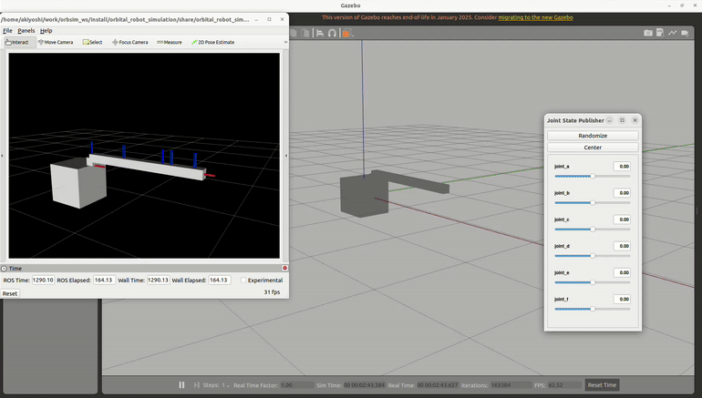

# Orbital Robot Simulation - Gazebo

This is a Repository to obtain basic understanding of floating robot.



## Requirement

- Ubuntu 22.04
- ROS 2 Humble

## How to start

You can find detailed information [Here](https://srl.esa.io/posts/623/edit) in Japanese.

## Create workspace

1. Create workspace directory

```bash
mkdir -p orbsim_ws/src
cd orbsim_ws/src
```

2. Clone this repository

```orbsim_ws/src
git clone git@github.com:Space-Robotics-Laboratory/OrbitalRobotSimulation_Gazebo.git
```

## Install required packages

1. Install rosdep

```
sudo apt install python3-rosdep
```

2. Init rosdep (Only first time)

```
sudo rosdep init
rosdep update # do not put sudo first
```

3. Install required packages by using rosdep command

```At ormsim_ws directory
rosdep install --from-paths src --ignore-src -r -y
```

> [!NOTE]
>If rosdep does not work well, install manually via following command
>
>```
>sudo apt install ros-humble-ros2-control ros-humble-ros2-controllers ros-humble-gazebo-ros ros-humble-joy ros-humble-plotjuggler ros-humble-gazebo-ros-pkgs
>```

## Build

1. Move to workspace

```
cd orbsim_ws
```

2. Build using colcon

```At ormsim_ws directory
colcon build --symlink-install
```

## Launch simulation

1. Do not forget to source workspace after build

``` At ormsim_ws directory
source install/setup.bash
```

2. Launch

``` At ormsim_ws directory
ros2 launch orbital_robot_simulation sar_gazebo.launch.py
```
